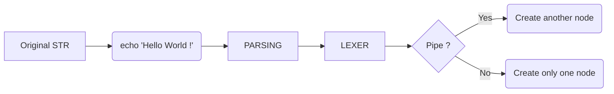
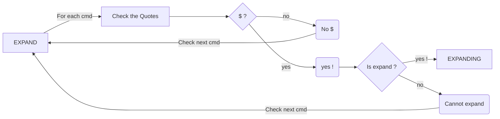

*This project has been created as part of the 42 curriculum by mcrenn and ansimonn*

# Minishell

## Description
### Overview
Minishell est un projet de groupe dont l'objectif est de reproduire le comportement d'un terminal Bash. Nous n'avons pas fait les bonus, certaines commandes comme #todo, ne sont donc pas inclues dans notre programe.

### How it works
When the program runs, a line appears on the terminal with the text `Goth_in_the_shell>`; this line, which is linked to [readline](https://man7.org/linux/man-pages/man3/readline.3.html), will wait for user input. \
Once the command has been written, the entire string will be sent to a lexer. \
The lexer will split the string into a linked list and create nodes based on the number of [pipe](https://man7.org/linux/man-pages/man2/pipe.2.html) characters `|` it finds in the string.
For each node created, there will be:
- An int "infile" that corresponds to the input to a pipe
- An int "outfile" that corresponds to the output in a pipe.
- A t_command (struct) "*cmd" that corresponds to a chained list for the current command.
- A s_token (struct) "*next", which is a pointer to the next node.

The lexer will also check whether certain commands contain the characters `<`, `>`, `<<`, and `>>`. \
These signals all indicate a redirection; if any of them is detected, the `input` and `output` of the corresponding node will be open, and the following behaviors will be observed:
- Input `<` Open the selected file.
- Output `>` Delete the contents of a file to write into it.
- Heredoc `<<` is a form of input that allows inserting multiple lines of text into a command without requiring multiple `echo` statements.
- Append `>>` Adds content to the file without deleting its original content.

Once the lexer has finished, the chained list is sent to `expand`. \
The purpose of the `expand` command is to check whether the character `$` is present in the current command. If that's the case, it will check whether the word after the `$` exists in [env](https://unix.stackexchange.com/questions/103467/what-is-env-command-doing), and if it finds anything, it will replace the name of that environment variable with the result ! \
Note that the behavior may change depending on whether the variable is enclosed in single or double quotes.

Once the “expand” part is complete, all that's left is to remove the quotes from each command.

Pipe System in Lexer:


Expand managing:


Once these steps are finished we get a list of tokens (1 token for each eventual piped command).
This list of tokens will go into the execution part were they'll be executed into builtins commands
(for cd, export, unset, echo, env, pwd and exit) or executed using execve().

## Instructions
In order to launch the program correctly, you must first clone the repository #todo(lien).
```bash
git clone https://github.com/Xuatlox/Goth-in-the-Shell.git
```
Next, use the `make` command to compile the minishell files and the libft library.
```bash
make all
```
After that, you can now run the program by the following command:
```bash
# Running the program, it did not take any argument
./minishell
```
To conclude those instructions, you will now have a a new terminal entry like `Goth_in_the_Shell>`, right after this line, you can type anything you want and thats where you'll put a command:
```bash
# Here, the command is: echo "Hello World !"
Goth_in_the_Shell> echo "Hello World !"
    Hello World !
Goth_in_the_Shell>
```
## Ressources
- A quick [guide](https://blog.devgenius.io/lets-build-a-linux-shell-part-i-954c95911501) to uderstand how the parsing work.
- A [spreadsheet](https://docs.google.com/spreadsheets/d/1uJHQu0VPsjjBkR4hxOeCMEt3AOM1Hp_SmUzPFhAH-nA/edit?pli=1&gid=0#gid=0) containing a lot of minishell test.
- A guide to understant [Heredoc](https://anju-chaurasiya2012.medium.com/heredocs-in-bash-scripting-5f4d8b7589d1)
- GNU readline [documentation](https://web.mit.edu/gnu/doc/html/rlman_2.html)
- Command's behavior [examples](https://docs.google.com/spreadsheets/d/1uJHQu0VPsjjBkR4hxOeCMEt3AOM1Hp_SmUzPFhAH-nA/edit?pli=1&gid=0#gid=0)
- Global [project management](https://github.com/MarKowPowLow/documentation_minishell_FSI)
- Minishell [functions descriptions](https://42-cursus.gitbook.io/guide/3-rank-03/minishell/functions)
- How to manage [signals in C](https://www.codequoi.com/envoyer-et-intercepter-un-signal-en-c/)

### Special shout out to our great teacher mperrine !
